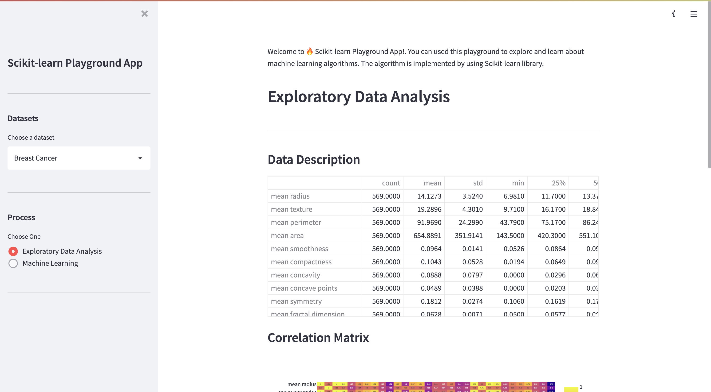

    

<h1 align="center">Scikit-Learn Playground App</h1>

### About The Project
Originaly, this repo is created for my undergraduate students to learn and experiment with machine learning algorithms.

<!-- Insert image-->


#### Built with
- Python
- Scikit-Learn
- Streamlit
- Pandas
- Plotly

### Getting Started

Assume you have conda installed, run this commands.

- Clone the repo
    ```
    git clone https://github.com/rudyhendrawn/scikit-learn-playground-app.git
    ```
- Change directory to repo
    
    ```
    cd scikit-learn-playground-app
    ```
- Create environment and dependencies
    ```
    conda create env -f environment.yml
    ```
- Activate environment   
    ```
    conda activate play-sklearn
    ```
- Run app
    ```
    streamlit run app.py
    ```
    
### To do
| Features| Status |
| :--- | :----: |
| Optimize the web app | :white_check_mark: |
| Add more machine learning algorithms e.g. SVM, Boosting Tree, Naive Bayes, etc. | :soon: |
| Add another machine learning problem e.g. regression. | :soon: |
| Add more classification metrics e.g. precision, recall, f1 score, etc. | :soon: |


if you like this repository, please consider giving a :star: to show your support.

### License
This project is licensed under the MIT License.


